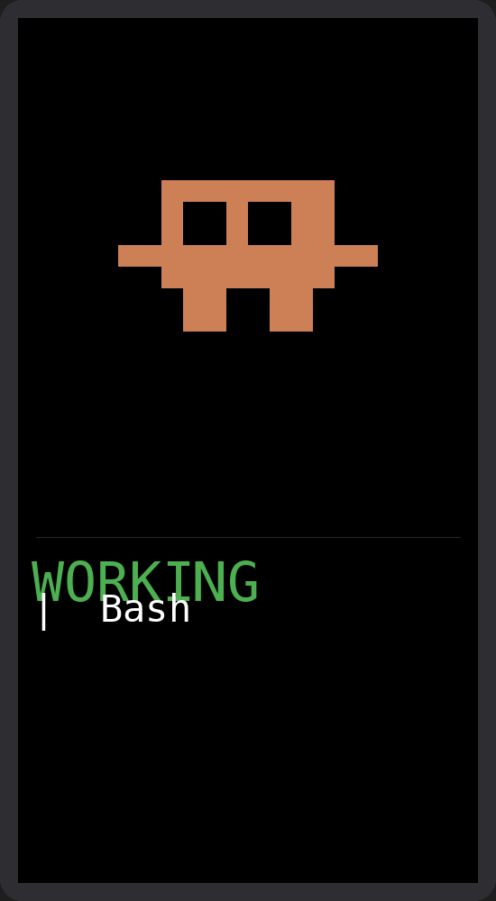
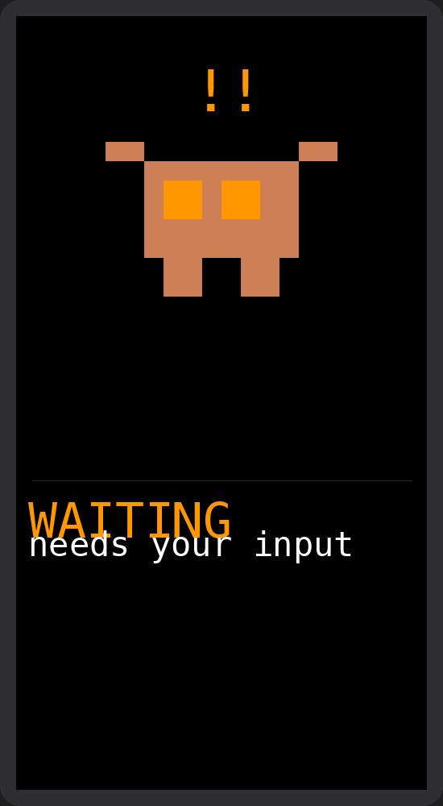
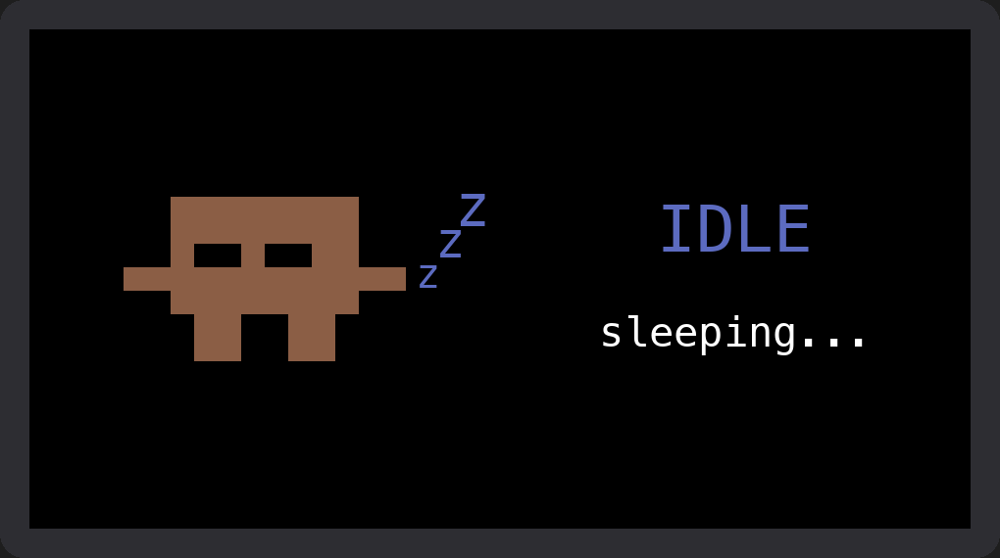
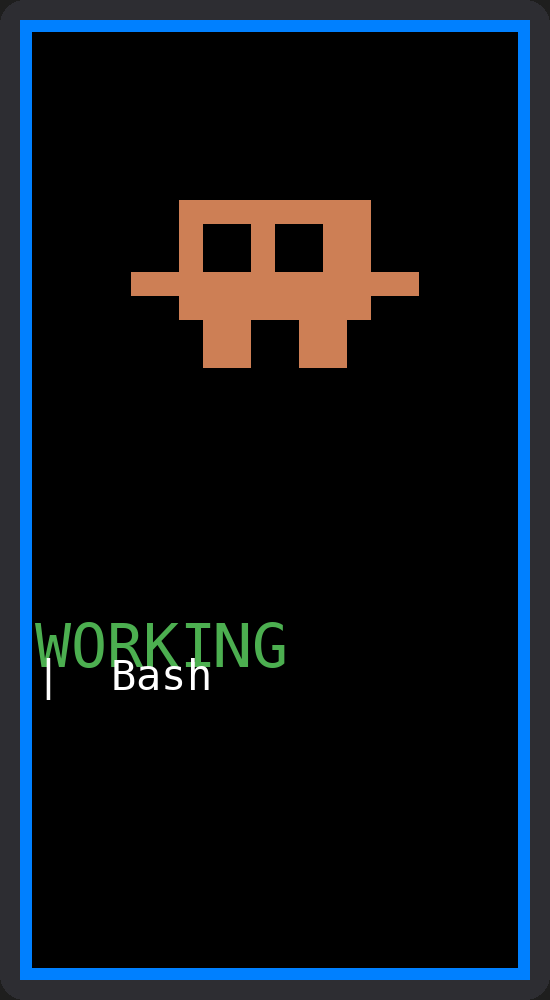

# Claude Watcher

A physical status monitor for [Claude Code](https://docs.anthropic.com/en/docs/claude-code) sessions. An ESP32 device with a TFT display shows an animated pixel-art crab that reflects what Claude is doing in real time — working, waiting for input, or sleeping.

```
    ┌─────────────────┐         BLE          ┌──────────────────┐
    │  macOS Menu Bar │ ──────────────────── │  ESP32 + Display │
    │  ClaudeWatcher  │                      │  Pixel-Art Crab  │
    └────────┬────────┘                      └──────────────────┘
             │
    Claude Code Hooks
    (tool use, prompts,
     notifications)
```

## States

The crab has three animated states, plus a notification overlay:

### Working
Crab walks — legs alternate every 300ms. The status bar shows the current tool name with a spinning indicator.



### Waiting
Claws raised, orange alert eyes, blinking `!!` above the head. Claude needs your input.



### Idle
No activity for 5 minutes. Dimmed crab with closed eyes. Floating `z` characters drift upward.



### Notification
Blue 4px border blinks around the screen for 2 minutes. Overlays any active state.



## Hardware

- **Board:** [LilyGo T-Display S3](https://www.lilygo.cc/products/t-display-s3) (ESP32-S3)
- **Display:** 170x320px TFT LCD
- **Communication:** Bluetooth Low Energy (BLE)
- **Button:** Double-click IO14 to rotate display (4 orientations)

## Architecture

```
┌─────────────────────────────────────────────────────────┐
│                     Claude Code                         │
│  hooks: PreToolUse, PostToolUse, Notification, Stop ... │
└──────────────────────────┬──────────────────────────────┘
                           │ Python hook scripts
                           v
                  ┌─────────────────┐
                  │  Unix Socket    │
                  │  IPC Server     │
                  │  /tmp/claude-   │
                  │  watcher.sock   │
                  └────────┬────────┘
                           │
                  ┌────────v────────┐
                  │  macOS Menu Bar │
                  │  App (rumps)    │
                  │  + BLE Central  │
                  │  (bleak)        │
                  └────────┬────────┘
                           │ BLE write
                           v
                  ┌─────────────────┐
                  │  ESP32-S3       │
                  │  BLE Peripheral │
                  │  (NimBLE)       │
                  │  + TFT Display  │
                  └─────────────────┘
```

### BLE Protocol

Plain ASCII messages over a single BLE characteristic:

| Message | Meaning |
|---|---|
| `WORKING:<tool>` | Claude is executing `<tool>` (e.g. `Bash`, `Read`) |
| `WAITING` | Claude finished, awaiting user reply |
| `WAITING_URGENT` | Claude needs permission |
| `IDLE` | Explicit idle signal |
| `NOTIFICATION` | Trigger 2-min blinking border |

## Project Structure

```text
claude-watcher/
├── esp32/claude_watcher/       # ESP32 firmware (Arduino)
│   ├── claude_watcher.ino      # Main loop, state machine
│   ├── ble_handler.cpp/.h      # BLE peripheral (NimBLE)
│   ├── display.cpp/.h          # TFT rendering & animations
│   ├── crab_sprites.h          # Pixel-art sprite frames
│   └── serial_handler.cpp/.h   # Message parsing
│
├── macos/                      # macOS companion app
│   ├── ClaudeWatcher/          # Menu bar app
│   │   ├── app.py              # rumps menu bar UI
│   │   ├── ble_manager.py      # BLE central (bleak)
│   │   ├── ipc_server.py       # Unix socket server
│   │   └── config.py           # UUIDs, paths, constants
│   ├── hooks/                  # Claude Code hook scripts
│   │   ├── on_pre_tool.py
│   │   ├── on_post_tool.py
│   │   ├── on_notification.py
│   │   ├── on_stop.py
│   │   └── ...
│   ├── tests/                  # Unit tests
│   └── install.sh              # Build & install script
│
└── TESTING.md                  # Manual integration test guide
```

## Setup

### ESP32 Firmware

1. Install [Arduino IDE](https://www.arduino.cc/en/software)
2. Add ESP32-S3 board support
3. Install libraries: **TFT_eSPI** (configured for T-Display S3), **NimBLE-Arduino**
4. Open `esp32/claude_watcher/claude_watcher.ino`
5. Compile and upload (baud 115200)

### macOS App

```bash
cd macos
pip install py2app rumps bleak
./install.sh
```

This builds `ClaudeWatcher.app`, installs it to `/Applications`, and sets up a launchd agent for autostart.

### Claude Code Hooks

The install script configures Claude Code hooks automatically. To verify, check your Claude Code settings for hooks pointing to the `macos/hooks/` scripts.

## License

MIT
